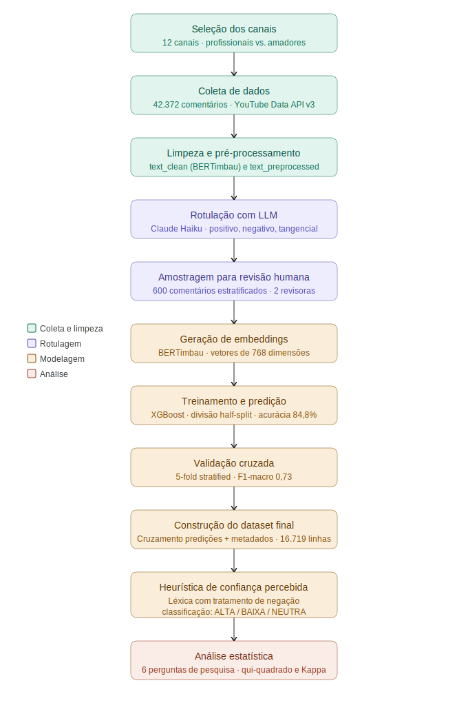

## Resumo

A proliferação de conteúdos sobre saúde mental no YouTube por criadores sem formação técnica suscita questões sobre os diferentes impactos emocionais gerados em comparação aos produzidos por profissionais da área. Este trabalho propõe e implementa um pipeline computacional para coletar, rotular e analisar comentários de vídeos do YouTube, comparando as reações do público entre canais de criadores profissionais e amadores. Foram coletados 42.372 comentários de 79 vídeos de 12 canais, sendo seis operados por profissionais de saúde e seis por criadores sem formação técnica. Os comentários foram rotulados automaticamente quanto à polaridade emocional (POSITIVO, NEGATIVO, TANGENCIAL) pelo modelo de linguagem Claude Haiku e, em seguida, reclassificados por um classificador supervisionado composto por *embeddings* do BERTimbau e XGBoost, com desempenho validado por validação cruzada e concordância substancial com os rótulos do LLM. A confiança percebida pelo público foi avaliada por heurística baseada em palavras-chave. A análise estatística via qui-quadrado revelou diferenças significativas entre os grupos em quatro das seis perguntas de pesquisa: canais amadores concentram maior proporção de comentários positivos e de maior certeza classificatória do modelo, enquanto canais profissionais geram proporcionalmente mais comentários tangenciais (relatos pessoais e referências ao tema sem reação direta ao vídeo). Os resultados evidenciam que o perfil do criador influencia tanto a receptividade emocional do público quanto o tipo de engajamento, oferecendo subsídios para práticas mais responsáveis de divulgação de informações sobre saúde mental em plataformas digitais.

**Palavras-chave:** Inteligência Artificial; Processamento de Linguagem Natural; Análise de Sentimentos; Saúde Mental; YouTube; BERTimbau.

## Abstract

The proliferation of mental health content on YouTube by creators without technical training raises questions about the different emotional impacts generated compared to content produced by healthcare professionals. This work proposes and implements a computational pipeline to collect, label, and analyze YouTube video comments, comparing audience reactions between channels run by professional and amateur creators. A total of 42,372 comments were collected from 79 videos across 12 channels, six operated by healthcare professionals and six by non-specialist creators. Comments were automatically labeled for sentiment polarity (POSITIVE, NEGATIVE, TANGENTIAL) using the Claude Haiku language model and subsequently reclassified by a supervised classifier combining BERTimbau embeddings and XGBoost, with performance validated through cross-validation and substantial agreement with the LLM labels. Perceived audience confidence was assessed using a keyword-based heuristic. Statistical analysis via chi-square revealed significant differences between groups in four of six research questions: amateur channels concentrate a higher proportion of positive comments and higher classifier certainty, while professional channels generate proportionally more tangential comments (personal accounts and topic references without direct reaction to the video). The results demonstrate that creator profile influences both the emotional receptiveness of the audience and the type of engagement generated, providing insights for more responsible practices in mental health information dissemination on digital platforms.

**Keywords:** Artificial Intelligence; Natural Language Processing; Sentiment Analysis; Mental Health; YouTube; BERTimbau.

# 1. Introdução

## 1.1) Contextualização do problema de pesquisa

A crescente presença de conteúdos digitais sobre saúde e bem-estar nas plataformas de vídeo, especialmente no YouTube, tem provocado mudanças significativas na forma como as pessoas buscam e recebem informações sobre saúde mental e qualidade de vida. O consumo de vídeos que abordam temas como ansiedade, depressão, autocuidado e equilíbrio emocional aumentou expressivamente nos últimos anos, tornando o YouTube um espaço de troca e influência emocional. No entanto, essa popularização também traz desafios, pois parte dos conteúdos sobre saúde mental é produzida por pessoas sem formação técnica, o que pode gerar interpretações equivocadas, reforçar estigmas ou induzir comportamentos inadequados.

Nesse cenário, compreender como o público reage emocionalmente a esse tipo de conteúdo torna-se essencial e, mais especificamente, se essa reação varia conforme o perfil do criador. Comentários postados pelos usuários constituem um registro espontâneo de percepções e emoções, funcionando como indicadores de como determinados vídeos impactam a audiência. Contudo, o grande volume de comentários torna inviável uma análise manual, o que justifica o uso de abordagens automatizadas baseadas em Inteligência Artificial (IA) e Processamento de Linguagem Natural (NLP). Essas técnicas permitem extrair e interpretar padrões de sentimento presentes nas interações digitais, oferecendo um meio eficiente para avaliar o impacto emocional de conteúdos sobre saúde mental [@tan2023; @souza2021].

## 1.2) Definição e delimitação do problema de pesquisa

O problema central deste estudo consiste em compreender de que forma os vídeos sobre saúde mental e bem-estar disponíveis no YouTube influenciam emocionalmente seus espectadores, em particular, se esse impacto difere entre conteúdos produzidos por profissionais de saúde credenciados e por criadores sem formação técnica na área. Embora existam avanços em análise de sentimentos e aprendizado de máquina, grande parte das pesquisas ainda se concentra em textos escritos em inglês e em contextos formais, como artigos, resenhas e redes profissionais. Isso cria uma lacuna significativa quanto à aplicação dessas técnicas a textos em português brasileiro, especialmente quando se trata de comentários informais e espontâneos produzidos em plataformas digitais [@souza2021; @afonso2019].

Desse modo, o presente trabalho delimita-se à análise de comentários em língua portuguesa extraídos do YouTube, relacionados a vídeos sobre saúde mental e bem-estar de 12 canais; seis operados por profissionais de saúde (como médicos e psicólogos) e seis por criadores sem formação técnica na área. Os comentários foram classificados em quatro categorias de sentimento: POSITIVO (reação emocional favorável ao vídeo), NEGATIVO (reação emocional desfavorável), TANGENCIAL (relatos pessoais ou opiniões sobre o tema, sem referência direta ao vídeo) e DESCARTÁVEL (ausência de sentimento relevante). Essa classificação permite compreender de forma mais precisa o impacto emocional e social dos vídeos voltados à saúde e ao autocuidado mental na comunidade brasileira online, diferenciando o efeito produzido por criadores profissionais e amadores.

## 1.3) Objetivos Geral e Específicos da pesquisa

O objetivo geral desta pesquisa é analisar comparativamente o impacto emocional de vídeos do YouTube relacionados à saúde e bem-estar produzidos por profissionais de saúde e por criadores amadores, por meio da classificação automatizada de sentimentos expressos nos comentários dos espectadores. A proposta busca compreender de que forma os comentários refletem o efeito emocional diferenciado causado pelos dois perfis de criadores, contribuindo para uma visão mais ampla sobre como conteúdos digitais podem influenciar percepções, sentimentos e comportamentos associados ao autocuidado e à conscientização sobre saúde mental.

De forma complementar ao objetivo geral, a pesquisa buscou atingir os seguintes objetivos específicos:

- Coletar e organizar um corpus de comentários em língua portuguesa provenientes de canais profissionais e amadores de saúde mental e bem-estar no YouTube;
- Classificar automaticamente os comentários em categorias de sentimento utilizando um *pipeline* que combina rotulação por modelo de linguagem de grande porte (*Large Language Model*, LLM) e um classificador supervisionado baseado em *embeddings* contextuais gerados pelo modelo *BERTimbau*;
- Comparar padrões de sentimento, certeza classificatória e confiança percebida entre comentários de canais profissionais e amadores;
- Avaliar a concordância entre a rotulação realizada pelo LLM e as predições do classificador supervisionado, verificando a viabilidade do *pipeline* proposto.

O terceiro objetivo específico, referente à comparação de padrões de sentimento, certeza classificatória e confiança percebida entre os grupos, é operacionalizado por meio de seis perguntas de pesquisa que orientam a análise quantitativa deste trabalho:

- **P1:** Há diferença estatisticamente significativa na distribuição de sentimentos em comentários de alto engajamento (likeCount ≥ 10) entre canais profissionais e amadores?
- **P2:** Há diferença estatisticamente significativa na distribuição geral de sentimentos entre os dois grupos?
- **P3:** Há diferença estatisticamente significativa na certeza classificatória do XGBoost entre comentários de canais profissionais e amadores?
- **P4:** Há diferença estatisticamente significativa na proporção de comentários com alta confiança percebida entre os dois grupos?
- **P5:** Qual o grau de concordância entre os rótulos atribuídos pelo LLM e as predições do classificador XGBoost?
- **P6:** Há diferença estatisticamente significativa na proporção de comentários tangenciais entre canais profissionais e amadores?

Os resultados obtidos para cada uma dessas perguntas são apresentados e discutidos na Seção 4.

## 1.4) Contribuições da pesquisa para a academia e sociedade

A relevância desta pesquisa manifesta-se em duas dimensões complementares: acadêmica e social.

Do ponto de vista acadêmico, o estudo amplia a aplicação de técnicas de Processamento de Linguagem Natural e aprendizado profundo à língua portuguesa, em um contexto ainda pouco explorado: o das interações informais em plataformas de vídeo. A utilização do modelo *BERTimbau* [@souza2020], pré-treinado especificamente para o português brasileiro, para a geração de *embeddings* contextuais representa um avanço técnico relevante ao adaptar abordagens de ponta a textos espontâneos. Adicionalmente, a adoção de um LLM para rotulação em larga escala e a comparação sistemática entre dois perfis distintos de criadores introduzem uma perspectiva nova no campo da análise de sentimentos em plataformas de vídeo. Assim, a pesquisa contribui para o estado da arte em NLP aplicado à análise de sentimentos, servindo de referência para investigações futuras em ambientes digitais.

No aspecto social, os resultados deste estudo fornecem evidências quantitativas sobre como o consumo de conteúdos de saúde mental produzidos por diferentes perfis de criadores afeta emocionalmente o público. Esses insumos podem subsidiar profissionais da saúde, comunicadores e plataformas digitais no desenvolvimento de estratégias mais responsáveis de divulgação e mediação de informação. Ao permitir uma leitura automatizada das reações emocionais dos espectadores, o estudo contribui para o fortalecimento de práticas comunicacionais que valorizem o bem-estar psicológico, a empatia e a disseminação de conteúdos confiáveis sobre saúde mental.

# 2. Referencial Teórico

## 2.1) Inteligência Artificial e Aprendizado de Máquina

A Inteligência Artificial (IA) é o campo da ciência da computação dedicado à criação de sistemas capazes de realizar tarefas que, quando executadas por humanos, exigiriam inteligência, como raciocínio, aprendizado e tomada de decisão. Esses sistemas processam grandes volumes de dados e extraem padrões complexos de forma automática, permitindo a construção de aplicações capazes de adaptar seu comportamento a novos contextos [@russell2021; @goodfellow2016]. No contexto da classificação automática de textos, o subcampo do Aprendizado de Máquina (*Machine Learning*), que permite que computadores imitem a maneira como os seres humanos aprendem, provê os métodos para que algoritmos aprendam padrões a partir de dados rotulados e generalizem decisões para novos exemplos [@tan2023]. @souza2021 destacam que abordagens supervisionadas têm sido amplamente aplicadas à análise de sentimentos, por possibilitarem a identificação automática de polaridades a partir de bases de comentários rotulados.

Apesar dos avanços significativos no campo do aprendizado de máquina, observa-se que grande parte dos estudos em análise de sentimentos permanece concentrada em contextos genéricos e em língua inglesa. Ainda há uma lacuna na aplicação de modelos supervisionados a dados em português e, especialmente, a interações digitais relacionadas à saúde mental. O presente trabalho busca contribuir nesse sentido, aplicando técnicas de aprendizado supervisionado a dados reais do YouTube, voltados a conteúdos de saúde e bem-estar.

## 2.2) Processamento de Linguagem Natural (NLP)

O Processamento de Linguagem Natural (*Natural Language Processing*, NLP) é uma subárea da Inteligência Artificial dedicada a permitir que máquinas compreendam, processem e analisem a linguagem humana [@jurafsky2023]. O NLP combina linguística computacional com técnicas estatísticas e redes neurais, modelos inspirados no cérebro humano que aprendem padrões a partir de dados, possibilitando a extração de significados e a análise semântica de textos [@goodfellow2016]. Segundo @souza2021, essa área é central para o desenvolvimento de sistemas de análise de sentimentos, uma vez que lida diretamente com a extração de significados e emoções em textos curtos e informais, como comentários em redes sociais e plataformas de vídeo.

No contexto deste trabalho, o NLP representa o elo entre a comunicação humana e os algoritmos de aprendizado de máquina. É a partir do processamento linguístico que se torna possível quantificar e interpretar o impacto emocional que os vídeos sobre saúde mental exercem sobre a comunidade que os assiste.

Embora o NLP tenha alcançado avanços expressivos, os estudos ainda se concentram em ambientes formais de linguagem, com dados estruturados e padronizados. Falta, portanto, uma investigação mais profunda sobre a aplicação dessas técnicas em contextos de linguagem informal, como comentários do YouTube, que refletem o comportamento emocional espontâneo dos usuários. Este trabalho busca suprir essa lacuna ao empregar NLP na análise de discursos informais e emocionais, oferecendo uma visão mais próxima da experiência social real dos usuários.

## 2.3) Representação Textual e Modelos de Classificação em NLP

O Processamento de Linguagem Natural exige a transformação de textos em representações numéricas, de modo que possam ser interpretados por algoritmos de aprendizado de máquina. Essa representação é a base para a aplicação de modelos de classificação, que têm por objetivo atribuir rótulos ou categorias a novos textos com base em padrões aprendidos a partir de exemplos previamente rotulados [@li2021; @tan2023].

Inicialmente, o NLP utilizava representações estatísticas, como o *TF-IDF* (*Term Frequency–Inverse Document Frequency*), que converte textos em vetores ponderados conforme a frequência e a relevância das palavras no corpus. Essa técnica se mostrou simples, eficiente e amplamente utilizada em tarefas supervisionadas. No estudo de @souza2021, o *TF-IDF* foi empregado com diferentes classificadores e obteve resultados expressivos, especialmente quando combinado ao *LightGBM* e à Regressão Logística. Apesar de eficientes, métodos baseados apenas em frequência não capturam o significado semântico das palavras nem suas relações contextuais.

Para superar essas limitações, surgiram as representações distribuídas (*word embeddings*), que mapeiam palavras para vetores contínuos de alta dimensão, de forma que termos semanticamente semelhantes ocupem posições próximas no espaço vetorial [@bojanowski2016; @souza2021]. Os modelos Word2Vec [@mikolov2013], GloVe [@pennington2014] e FastText [@bojanowski2016] marcaram essa evolução.

O avanço seguinte foi impulsionado pelo aprendizado profundo (*deep learning*) e, em particular, pelo *ULMFiT* [@howard2018], que introduziu o conceito de aprendizado por transferência em NLP, permitindo que modelos pré-treinados fossem ajustados a tarefas específicas. Posteriormente, o surgimento do *BERT* (*Bidirectional Encoder Representations from Transformers*) redefiniu o campo: proposto por @devlin2019, o *BERT* introduziu *embeddings* contextuais, nos quais a representação de cada palavra varia de acordo com o contexto em que aparece, superando as limitações dos *embeddings* estáticos.

No contexto do português brasileiro, @souza2020 desenvolveram o *BERTimbau*, o primeiro modelo *BERT* pré-treinado especificamente para a língua portuguesa, utilizando o *Brazilian Web as Corpus* (*brWaC*). Os autores apresentaram duas versões, *BERTimbau Base* e *BERTimbau Large*, que superaram o desempenho do modelo multilíngue *BERT* em tarefas como inferência textual, similaridade semântica e reconhecimento de entidades nomeadas. O uso de um vocabulário construído a partir de dados do português e o treinamento prolongado aumentam significativamente a sensibilidade do modelo às nuances da língua. Por essa razão, o presente trabalho utiliza o *BERTimbau* para a geração de *embeddings* contextuais dos comentários, como feature extractor com pesos congelados.

Embora os *embeddings* contextuais do *BERTimbau* ofereçam representações ricas dos textos, a classificação propriamente dita demanda um algoritmo capaz de operar sobre esses vetores de forma eficiente e robusta. Este trabalho adotou o *XGBoost* (*Extreme Gradient Boosting*) [@chen2016], algoritmo de aprendizado supervisionado baseado em conjuntos de árvores de decisão que implementa o *gradient boosting* com regularização integrada, suporte a ponderação de amostras por classe e alto desempenho computacional. Essa combinação, na qual um modelo *Transformer* atua como extrator de características e um algoritmo de *ensemble* realiza a classificação final, reúne o poder representacional dos modelos contextuais à robustez e eficiência dos métodos tradicionais, sendo adotada com sucesso em tarefas de classificação de texto em domínios especializados [@li2021].

## 2.4) Análise de Sentimentos em Plataformas Digitais

A aplicação prática de técnicas de análise de sentimentos em contextos digitais é de grande relevância para compreender a recepção de conteúdos na internet. @afonso2019 analisaram comentários de vídeos do YouTube utilizando *SVM* (*Support Vector Machine*) com vetorização *TF-IDF* e demonstraram que a acurácia do modelo depende diretamente da uniformidade temática do corpus. Quando os comentários se referiam ao mesmo objeto (ou "entidade dominante"), o modelo alcançou 81% de acurácia e F1-score de 0,806, superando os experimentos mais amplos com múltiplos tópicos.

Os autores ressaltam que a linguagem informal, o uso de ironias e as variações linguísticas do português nas interações digitais representam desafios para a classificação automatizada de sentimentos. Esses achados reforçam a necessidade de modelos mais sensíveis ao contexto, como o *BERTimbau*, que é capaz de capturar nuances semânticas e emocionais. Além das abordagens baseadas em aprendizado de máquina, métodos léxicos e heurísticos mantêm relevância em contextos nos quais a interpretabilidade e o controle sobre o processo de classificação são prioritários. @taboada2011 demonstraram que abordagens baseadas em léxicos de orientação semântica (listas de palavras com polaridades previamente atribuídas) alcançam desempenho competitivo em tarefas de análise de sentimentos, especialmente quando combinadas a regras de tratamento de negação e modificadores de intensidade. Essa abordagem é particularmente adequada para a identificação de sinais explícitos de credibilidade percebida em textos, cenário em que a correspondência de palavras-chave permite extrair indicadores sem necessidade de treinamento supervisionado.

A avaliação quantitativa de resultados em análise de sentimentos recorre a ferramentas estatísticas consolidadas. O teste qui-quadrado (χ²) é amplamente empregado para verificar se a distribuição de categorias entre dois grupos difere de forma estatisticamente significativa [@mchugh2013]. Para mensurar a concordância entre dois sistemas de classificação ou anotadores, o coeficiente Kappa de Cohen, proposto por @cohen1960, quantifica a concordância além do acaso; sua interpretação segue a escala de @landis1977, na qual valores entre 0,61 e 0,80 indicam concordância substancial. Ambas as ferramentas são utilizadas neste trabalho para avaliar os resultados da análise comparativa e validar a consistência entre as anotações do LLM e as predições do classificador supervisionado.

Embora os trabalhos existentes demonstrem o potencial das técnicas de aprendizado supervisionado em comentários do YouTube, ainda são raros os estudos que associam a análise de sentimentos ao impacto psicológico dos conteúdos de saúde mental e que comparam sistematicamente diferentes perfis de criadores. Dessa forma, este trabalho diferencia-se por propor uma abordagem que alia tecnologia e bem-estar digital.

## 2.5) NLP Aplicado à Saúde Mental e Bem-Estar

O uso de modelos de linguagem para compreender aspectos de saúde mental vem crescendo nos últimos anos. A análise de comentários em plataformas como o YouTube pode oferecer indicadores valiosos sobre o impacto psicológico e emocional dos conteúdos voltados ao bem-estar e à saúde. Ao aplicar técnicas de análise de sentimentos a esses dados, é possível identificar padrões de reação do público, revelando se os vídeos provocam percepções positivas, negativas ou neutras.

Essa abordagem se alinha ao que @souza2021 apontam como tendência: a utilização de modelos de aprendizado de máquina para interpretar interações humanas em larga escala, auxiliando na construção de ferramentas de monitoramento social e emocional. A incorporação de modelos de última geração, como o *BERTimbau* [@souza2020], permite elevar o nível de precisão dessas análises, contribuindo para que os resultados sirvam como suporte à conscientização sobre o impacto emocional do consumo de conteúdo digital relacionado à saúde mental. Apesar do avanço de modelos como o *BERTimbau*, observa-se uma escassez de pesquisas que apliquem essas arquiteturas ao domínio específico da saúde mental e ao ambiente multimodal do YouTube, lacuna que o presente estudo busca preencher.

## 2.6) Modelos de Linguagem de Grande Porte como Anotadores de Dados

A construção de bases de dados rotuladas é uma etapa fundamental em tarefas de aprendizado supervisionado, porém historicamente custosa: a anotação manual exige tempo, equipes de revisores especializados e processos de verificação de concordância entre anotadores. @tan2024 apresentam uma revisão abrangente do uso de Modelos de Linguagem de Grande Porte (*Large Language Models*, LLMs) como alternativa para a geração e síntese de anotações, demonstrando que LLMs podem automatizar tarefas de rotulagem com custo e tempo significativamente menores do que a anotação humana tradicional.

@ding2023 avaliaram sistematicamente o desempenho do GPT-3 como anotador em diversas tarefas de NLP e concluíram que o modelo pode produzir anotações de qualidade comparável à de anotadores humanos em tarefas de classificação de sentimentos, especialmente quando instruído com diretrizes claras e exemplos de referência (*few-shot prompting*). Esses resultados sustentam a viabilidade do uso de LLMs para rotulagem em larga escala, desde que a qualidade das anotações seja monitorada.

Neste trabalho, utilizou-se o modelo Claude Haiku, pertencente à família Claude 3 da Anthropic [@anthropic2024], para a rotulação automática dos 42.372 comentários coletados. A escolha do Claude Haiku se justifica por seu custo operacional reduzido, velocidade de processamento e desempenho competitivo em tarefas de compreensão e classificação de texto em português. Para garantir a qualidade das anotações, adotou-se um *prompt* detalhado com exemplos de referência e uma amostra estratificada de 600 comentários foi separada para revisão humana, permitindo estimar a confiabilidade da rotulação automática.

# 3. Metodologia

Esta seção descreve o desenvolvimento do trabalho, apresentando as etapas executadas desde a coleta dos dados até a geração dos *embeddings* contextuais. A pesquisa adota uma abordagem mista (quali-quanti): o aspecto quantitativo manifesta-se na mensuração de métricas de desempenho do modelo e na classificação das categorias de sentimento dos comentários; já o aspecto qualitativo evidencia-se na interpretação contextual dos resultados e na análise das reações do público diante do conteúdo assistido.

## 3.1) Visão Geral do Pipeline

O pipeline metodológico é composto por cinco etapas sequenciais, implementadas em scripts Python independentes e documentadas em código aberto:

1. **Coleta de dados** — extração de comentários e metadados via YouTube Data API v3;
2. **Limpeza e pré-processamento** — normalização do corpus e criação de duas versões textuais para diferentes modelos;
3. **Rotulação automática** — classificação de todos os comentários em quatro categorias de sentimento por meio de um LLM;
4. **Amostragem para revisão humana** — seleção estratificada de 600 comentários para validação das anotações;
5. **Geração de *embeddings*** — transformação dos comentários em vetores contextuais de 768 dimensões utilizando o *BERTimbau*.

As etapas subsequentes são descritas na sequência da metodologia: treinamento do classificador supervisionado, avaliação do modelo e análise comparativa entre os grupos.

## 3.2) Seleção dos Canais e Critérios de Classificação

A seleção dos canais foi orientada pela distinção central desta pesquisa: comparar o impacto emocional de conteúdos produzidos por profissionais de saúde com o de conteúdos produzidos por criadores sem formação técnica na área. Foram selecionados 12 canais brasileiros do YouTube com foco em saúde mental e bem-estar, divididos em dois grupos:

**Canais profissionais** (criadores com formação acadêmica reconhecida na área de saúde):
Prazer, Karnal; Rossandro Klinjey; PodPeople – Ana Beatriz Barbosa; Augusto Cury; Minutos Psíquicos; Casa do Saber.

**Canais amadores** (criadores sem formação técnica na área de saúde):
ellora; JoutJout Prazer; Ludoviajante; Juliana Goes; Fred Elboni; Obvious.

O critério de classificação como "profissional" baseou-se na presença de formação acadêmica declarada na área de saúde (medicina, psicologia ou áreas correlatas) e na produção de conteúdo predominantemente técnico. Os canais amadores foram selecionados por sua relevância temática e audiência expressiva, sem vínculo com formação profissional na área de saúde. Ambos os grupos foram equilibrados em número de canais (seis cada) para permitir comparações proporcionais.

## 3.3) Coleta de Dados

A coleta de dados foi realizada de forma automatizada por meio de scripts em Python integrados à YouTube Data API v3, serviço oficial disponibilizado pelo Google que permite o acesso a informações públicas da plataforma. O processo de coleta foi guiado por dois parâmetros principais: até cinco vídeos por canal, selecionados entre os mais recentes com ao menos 650 comentários, e até 650 comentários por vídeo, coletados na ordem padrão retornada pela API (*top comments*).

Para cada comentário foram extraídos: identificador único (`commentId`), texto original, data de publicação, número de curtidas (`likeCount`), identificador do vídeo de origem e o tipo de canal (`channel_type`: `profissional` ou `amador`). Os metadados dos vídeos: título, descrição, contagem de visualizações, curtidas e comentários; foram coletados separadamente e armazenados em um arquivo auxiliar. Ao final da coleta, o corpus resultou em **79 vídeos** e **42.372 comentários**, com distribuição equilibrada entre os grupos: 50,4% de canais profissionais e 49,6% de canais amadores. Os dados foram armazenados em formato CSV (*Comma-Separated Values*), garantindo portabilidade e facilidade de tratamento nas etapas subsequentes. A coleta limitou-se a comentários de nível superior (*top-level comments*), excluindo respostas a comentários, de forma a padronizar a unidade de análise. Nenhuma informação pessoal identificável dos usuários foi retida, em conformidade com as normas éticas e de privacidade definidas pela plataforma e pela Lei Geral de Proteção de Dados (LGPD).

## 3.4) Limpeza e Pré-processamento dos Dados

Após a coleta, os dados passaram por duas etapas de tratamento sequenciais, implementadas nos scripts `01_clean_data.py` e `02_preprocess_text.py`.

**Limpeza estrutural (script 01):** foram removidos registros com texto nulo ou vazio, comentários duplicados (identificados pelo `commentId`), e registros com valores negativos para `likeCount`. Os *timestamps* foram convertidos para o formato UTC padronizado. Foram adicionadas colunas auxiliares: `text_length` (comprimento do texto em caracteres) e `is_substantive` (indicador booleano de que o comentário contém ao menos um caractere alfabético). Essas operações garantiram a integridade e a consistência do corpus antes das etapas de modelagem.

**Pré-processamento textual (script 02):** ao contrário de pipelines tradicionais de NLP que adotam uma única versão do texto, este trabalho criou duas representações textuais distintas, cada uma otimizada para um tipo diferente de modelo:

- `text_clean` — limpeza leve, adequada para o *BERTimbau*: remoção de URLs, menções (`@usuario`), *hashtags* (`#tópico`) e entidades HTML; conversão de emojis para descrição textual em português (por exemplo, 💛 → `:coração_amarelo:`); normalização de espaços. Maiúsculas, pontuação e acentos são preservados, pois o *BERTimbau* é um modelo *case-sensitive* que utiliza essas informações contextuais durante a codificação.

- `text_preprocessed` — pré-processamento completo, adequado para modelos tradicionais como *TF-IDF*: além das operações acima, conversão para minúsculas, remoção de acentos (normalização NFKD), remoção de caracteres não-linguísticos, tokenização, eliminação de *stopwords* em português (biblioteca NLTK) e *stemming* com o algoritmo RSLP (*Removedor de Sufixos da Língua Portuguesa*).

A razão para manter duas versões é técnica: modelos *Transformer* como o *BERTimbau* foram pré-treinados em texto real, com toda a sua riqueza contextual; normalizar o texto antes de passá-lo ao modelo destrói o contexto aprendido. Modelos baseados em frequência de palavras, por outro lado, beneficiam-se da normalização, pois ela reduz a esparsidade do vocabulário.

## 3.5) Rotulação com Modelo de Linguagem de Grande Porte

A rotulação do corpus foi realizada pelo modelo Claude Haiku [@anthropic2024], da família Claude 3 da Anthropic, via API, utilizando o script `03_llm_label.py`. A abordagem de usar um LLM como anotador automático em larga escala é respaldada pela literatura recente, que demonstra que modelos dessa classe podem produzir anotações de qualidade comparável à humana em tarefas de classificação de sentimentos [@ding2023; @tan2024].

**Schema de rotulação:** cada comentário foi classificado em uma de quatro categorias mutuamente exclusivas:

- **POSITIVO** — reação emocional favorável direcionada ao vídeo ou ao criador (gratidão, alívio após assistir, elogio ao conteúdo, identificação positiva com a abordagem);
- **NEGATIVO** — reação emocional desfavorável direcionada ao vídeo ou ao criador (crítica ao conteúdo, discordância da abordagem, avaliação do vídeo como inadequado ou perigoso);
- **TANGENCIAL** — comentário que tangencia o vídeo sem ser uma reação direta a ele (relato ou desabafo pessoal, opinião sobre o tema abordado — não sobre o vídeo em si, histórias de terceiros relacionadas ao assunto);
- **DESCARTÁVEL** — ausência de sentimento emocional relevante (perguntas factuais, *spam*, *timestamps*, emojis ambíguos isolados).

A regra central do *prompt* de sistema orientava o modelo a distinguir entre reações ao **vídeo** (classificadas como POSITIVO ou NEGATIVO) e reações ao **tema ou à própria vida** do comentarista (classificadas como TANGENCIAL). Para calibrar essa distinção, cada chamada à API incluía o título do vídeo antes do comentário, fornecendo o contexto necessário à classificação. Essa decisão foi motivada por uma validação iterativa: numa versão inicial do *pipeline*, sem o título do vídeo no *prompt*, a revisão manual de 600 comentários identificou 14% de rótulos incorretos, com erros concentrados na fronteira entre TANGENCIAL e POSITIVO. Após a inclusão do título como contexto adicional, uma nova rodada de revisão dos mesmos 600 comentários reduziu a taxa de erro para 3%, evidenciando o impacto direto do contexto do vídeo na qualidade da rotulação automática.

**Aspectos técnicos:** os comentários foram processados em lotes de 20 por chamada de API, com um *prompt* de sistema detalhado e oito exemplos de referência (*few-shot*). O script implementou um sistema de *checkpoint* automático, permitindo retomada sem reprocessamento em caso de interrupção, e um mecanismo de controle de custo com limite configurável (orçamento de R$ 40,00). A taxa de câmbio utilizada foi de R$ 5,80/USD, com tarifas de entrada de USD 0,80/MTok e saída de USD 4,00/MTok. O intervalo de 2,5 segundos entre lotes respeitou o limite de 50.000 tokens por minuto da API.

**Resultado:** todos os 42.372 comentários do corpus foram rotulados. A distribuição final foi: POSITIVO — 18.253 (43,1%); TANGENCIAL — 14.455 (34,1%); DESCARTÁVEL — 7.881 (18,6%); NEGATIVO — 1.783 (4,2%). A predominância de POSITIVO e TANGENCIAL e a raridade de NEGATIVO são consistentes com o comportamento típico de audiências em canais de saúde mental, onde comentários de suporte e relatos pessoais superam as críticas diretas.

## 3.6) Amostragem para Revisão Humana

Para estimar a confiabilidade da rotulação automática, o script `04_sample_for_review.py` gerou uma amostra estratificada de **600 comentários** para revisão manual, dividida igualitariamente entre dois revisores (300 cada). A estratificação priorizou a representação de categorias mais raras e potencialmente ambíguas, em especial NEGATIVO e comentários curtos, bem como comentários de alto engajamento (`likeCount` elevado), que têm maior peso analítico. Cada revisor avaliou os rótulos atribuídos pelo LLM com um esquema binário (OK / NOK), sinalizando discordâncias sem propor rótulos alternativos. A análise da parcela revisada por um dos revisores (300 comentários) revelou acordo global de 97,0% (291/300), com a seguinte distribuição por categoria:

| Categoria | Revisados | Acordo | NOK |
|---|---|---|---|
| POSITIVO | 147 | 99,3% | 1 |
| TANGENCIAL | 105 | 98,1% | 2 |
| NEGATIVO | 48 | 87,5% | 6 |
| **Total** | **300** | **97,0%** | **9** |

O resultado confirma a taxa de erro de 3% reportada na Seção 3.5 e evidencia que NEGATIVO é a categoria mais contestada pela revisão humana, padrão coerente com a dificuldade de classificação dessa classe identificada na Seção 4.5. O esquema binário adotado impede o cálculo de concordância categorial formal entre humanos e LLM, limitação discutida na Seção 5.

## 3.7) Geração de *Embeddings* com BERTimbau

A etapa final da fase de preparação de dados consistiu na transformação de cada comentário em um vetor numérico de alta dimensão, adequado para alimentar o classificador supervisionado. O script `05_generate_embeddings.py` utilizou o *BERTimbau* [@souza2020], especificamente o modelo `neuralmind/bert-base-portuguese-cased`, como extrator de *features* com **pesos congelados** (sem *fine-tuning*). Para cada comentário, extraiu-se o vetor correspondente ao *token* `[CLS]` da última camada oculta do modelo, uma representação de 768 dimensões que condensa o significado semântico e contextual do texto completo.

Comentários rotulados como DESCARTÁVEL foram excluídos desta etapa, pois não carregam sentimento emocional relevante e sua inclusão introduziria ruído no treinamento do classificador. Os demais 34.491 comentários (POSITIVO, NEGATIVO e TANGENCIAL) foram processados com os seguintes parâmetros: comprimento máximo de 128 *tokens* (suficiente para cobrir mais de 99% dos comentários do corpus), tamanho de lote de 32, em GPU (NVIDIA RTX 4060 Laptop, 8 GB VRAM), com tempo total de execução de aproximadamente 2 minutos. O mapeamento de rótulos adotado foi: NEGATIVO → 0, TANGENCIAL → 1, POSITIVO → 2.

Os artefatos gerados foram: `embeddings.npy`, matriz de dimensões (34.491 × 768) em formato `float32`; `labels.npy`, vetor de inteiros com os rótulos correspondentes; e `embedding_meta.csv`, arquivo de metadados com `commentId`, rótulo LLM, tipo de canal, curtidas e título do vídeo.

## 3.8) Treinamento e Predição por Divisão Half-Split

Para gerar as predições que alimentariam as etapas subsequentes de análise, adotou-se uma estratégia de divisão por ordem de coleta, implementada no script `06_xgboost_train_and_predict.py`. O corpus de 34.491 comentários foi dividido em duas metades sequenciais, preservando a ordem original de coleta: a primeira metade (17.772 comentários) foi utilizada exclusivamente para treinamento, e a segunda metade (16.719 comentários) exclusivamente para avaliação. Essa separação garante que as predições sobre a segunda metade são genuínas, pois o modelo não teve acesso a esses dados durante o treinamento.

O XGBoost foi configurado com `n_estimators=200`, `max_depth=6` e `learning_rate=0.1`, com pesos de amostra balanceados por classe. Na avaliação sobre a segunda metade, o modelo alcançou acurácia de 84,8%, F1-macro de 0,69 e F1-weighted de 0,84. Além do rótulo predito, o script calculou, para cada comentário, a coluna `confidence` (probabilidade máxima atribuída pelo classificador à classe predita, no intervalo de 0,0 a 1,0) e a coluna `certeza_xgb`, que categoriza essa probabilidade em três faixas: ALTA (confidence > 0,80), MÉDIA (0,60 ≤ confidence ≤ 0,80) e BAIXA (confidence < 0,60). Essa coluna representa a certeza do classificador sobre a predição — um indicador da separabilidade dos padrões linguísticos do comentário no espaço de decisão do modelo, não uma medida de intensidade emocional do texto. Na segunda metade, 78,0% dos comentários receberam certeza ALTA, 14,6% MÉDIA e 7,4% BAIXA. O modelo treinado foi serializado como `XGBoost_half.pkl` e as predições foram exportadas para `second_half_predictions.csv`.

## 3.9) Validação Cruzada do Classificador

Para verificar a capacidade de generalização do pipeline BERTimbau + XGBoost de forma complementar à avaliação por divisão half-split, realizou-se uma validação cruzada estratificada com cinco partições (*5-fold stratified cross-validation*) sobre a base completa de 34.491 comentários não-DESCARTÁVEL, implementada no script `06_cv_validation.py`. O objetivo dessa etapa é estritamente acadêmico: demonstrar que o pipeline aprende padrões generalizáveis a partir dos *embeddings* gerados pelo BERTimbau, independentemente da partição avaliada. Nenhum modelo foi persistido nessa etapa.

O classificador XGBoost foi configurado com os mesmos hiperparâmetros da etapa anterior, com pesos de amostra balanceados por classe para mitigar o impacto do desbalanceamento, em especial da classe NEGATIVO. Em cada iteração, o modelo foi treinado nas quatro partições e avaliado na partição restante. Os resultados médios obtidos foram: acurácia de 0,8600 (± 0,005), F1-macro de 0,7326 (± 0,004) e F1-weighted de 0,8576 (± 0,004). A estabilidade entre as partições, evidenciada pelos baixos desvios padrão, confirma a consistência do pipeline e corrobora os resultados obtidos na avaliação half-split.

## 3.10) Construção do Dataset Final

A etapa de construção do dataset final, implementada no script `07_build_final_dataset.py`, consolidou as predições do XGBoost com os metadados dos comentários. O arquivo `second_half_predictions.csv`, contendo as colunas `commentId`, `label_llm`, `label_xgb`, `confidence`, `certeza_xgb` e `concorda`, foi cruzado com `preprocessed_comments.csv` por meio de um *join* pela coluna `commentId`, incorporando o texto original, o texto tratado (`text_clean`), o tipo de canal, a contagem de curtidas e o título do vídeo.

Adicionalmente, o script calculou a coluna `keywords`, que registra os termos de credibilidade percebida encontrados no texto de cada comentário. A detecção foi realizada por correspondência direta de uma lista de 20 termos (como "especialista", "científico", "embasado" e "comprovado") ao texto normalizado em letras minúsculas. O resultado foi um dataset com 16.719 linhas e 12 colunas, salvo como `final_labeled_dataset.csv`, que serviu de entrada para a etapa seguinte de classificação de confiança percebida.

## 3.11) Heurística de Confiança Percebida

A classificação da confiança percebida foi realizada pelo script `08_credibility_heuristic.py`, que aplicou uma heurística léxica sobre a coluna `text_clean` de cada comentário [@taboada2011]. A heurística opera em quatro etapas sequenciais: (i) busca de termos de alta credibilidade em uma lista de 30 expressões (como "bem explicado", "informação correta" e "excelente conteúdo"); (ii) verificação de negação sobre cada termo encontrado, por meio de uma janela deslizante de três palavras anteriores ao termo, com o conjunto de negadores composto por "não", "nunca", "jamais", "nem", "nenhum" e "nada"; (iii) busca de termos de baixa credibilidade em uma lista de 23 expressões (como "pseudociência", "desinformação" e "sem base"), acrescida dos termos de alta credibilidade que foram negados na etapa anterior; (iv) determinação do sinal final a partir da combinação dos sinais detectados.

Se apenas sinais de alta credibilidade forem detectados, o comentário recebe `confianca_percebida` igual a ALTA. Se apenas sinais de baixa credibilidade, recebe BAIXA. Se ambos os tipos coexistirem, configura-se um conflito, resolvido pelo rótulo do XGBoost como árbitro: POSITIVO resulta em ALTA, NEGATIVO em BAIXA e TANGENCIAL em NEUTRA. Se nenhum sinal for detectado, o comentário recebe NEUTRA. Ao final, 92% dos comentários resultaram em NEUTRA, refletindo a ausência de indicadores explícitos de credibilidade na maioria dos textos. O dataset resultante, com a coluna `confianca_percebida` adicionada, foi salvo como `final_dataset.csv`, base de análise principal do trabalho.

## 3.12) Análise Estatística das Perguntas de Pesquisa

A etapa final do pipeline, implementada no script `09_analyze_results.py`, operou sobre `final_dataset.csv` para responder às seis perguntas de pesquisa. Para cada pergunta, foram calculadas distribuições de frequência absoluta e relativa por grupo (profissional e amador), seguidas de testes estatísticos de associação. Para as perguntas P1 a P4 e P6, aplicou-se o teste qui-quadrado (χ²) de independência [@mchugh2013], que verifica se as distribuições de categorias entre os dois grupos diferem de forma estatisticamente significativa, adotando-se nível de significância α = 0,05. Para a pergunta P5, utilizou-se o coeficiente Kappa de Cohen [@cohen1960] para mensurar a concordância entre os rótulos atribuídos pelo LLM e as predições do XGBoost, com interpretação segundo a escala de @landis1977. Os resultados gerados por este script são apresentados e discutidos na Seção 4.

# 4. Resultados e Discussão

Esta seção apresenta os resultados da análise comparativa entre comentários de canais profissionais e amadores, organizados conforme as seis perguntas de pesquisa. A base de análise é composta pelos 16.719 comentários da segunda metade do corpus, classificados pelo XGBoost de forma genuína. Para cada pergunta, são descritos os dados observados, o resultado do teste estatístico e a interpretação dos achados.

## 4.1) P1 — Sentimentos em Comentários de Alto Engajamento

A primeira pergunta investiga se a distribuição de sentimentos em comentários com alto engajamento (likeCount ≥ 10) difere entre os dois grupos. Do total de 16.719 comentários, 679 atenderam ao critério: 323 de canais profissionais e 356 de canais amadores.

| Rótulo | Profissional | Amador |
|---|---|---|
| POSITIVO | 34,67% (112) | 36,52% (130) |
| TANGENCIAL | 59,75% (193) | 59,83% (213) |
| NEGATIVO | 5,57% (18) | 3,65% (13) |

O teste qui-quadrado não revelou diferença estatisticamente significativa entre os grupos (χ² = 1,53, g.l. = 2, p = 0,465; V de Cramér = 0,047, efeito negligível). Os comentários de alto engajamento apresentam distribuição de sentimentos praticamente idêntica entre profissionais e amadores, com predominância de TANGENCIAL (cerca de 60% em ambos) e proporções semelhantes de POSITIVO. Esse resultado indica que, quando os comentários alcançam ressonância coletiva suficiente para acumular curtidas expressivas, o perfil do criador não determina o tipo de reação emocional que os originou. O alto engajamento parece funcionar como um filtro que seleciona comentários que ressoam com a audiência de forma independente do tipo de canal.

## 4.2) P2 — Distribuição Geral de Sentimentos na Base Completa

A segunda pergunta investiga se a distribuição geral de sentimentos difere entre canais profissionais e amadores na base completa de 16.719 comentários.

| Rótulo | Profissional | Amador |
|---|---|---|
| POSITIVO | 33,43% (2.296) | 67,37% (6.637) |
| TANGENCIAL | 61,71% (4.238) | 30,92% (3.046) |
| NEGATIVO | 4,86% (334) | 1,71% (168) |

O teste qui-quadrado revelou diferença altamente significativa entre os grupos (χ² = 1.887,33, g.l. = 2, p ≈ 0; V de Cramér = 0,336, efeito moderado). Canais amadores concentram a maioria dos comentários positivos (67,37% versus 33,43% nos canais profissionais), enquanto canais profissionais geram proporcionalmente muito mais comentários tangenciais (61,71% versus 30,92%). A proporção de comentários negativos é baixa nos dois grupos, sendo ligeiramente superior nos canais profissionais (4,86% versus 1,71%). O predomínio de comentários positivos nos canais amadores pode estar associado ao tom mais próximo e identificável de criadores que compartilham vivências pessoais, gerando reações de acolhimento e gratidão por parte do público.

## 4.3) P3 — Certeza Classificatória por Grupo

A terceira pergunta investiga se a certeza classificatória do XGBoost difere entre os grupos. A métrica utilizada é a coluna `certeza_xgb`, derivada da probabilidade máxima atribuída pelo classificador à classe predita: ALTA (> 0,80), MÉDIA (0,60–0,80) e BAIXA (< 0,60). Essa medida reflete a separabilidade dos padrões linguísticos do comentário no espaço de decisão do modelo — comentários com padrões lexicais mais típicos de sua classe recebem certeza mais alta. A análise foi restrita aos comentários classificados como POSITIVO ou NEGATIVO, excluindo TANGENCIAL, resultando em 2.630 comentários de canais profissionais e 6.805 de canais amadores.

| Certeza | Prof. total | Prof. POSITIVO | Prof. NEGATIVO |
|---|---|---|---|
| ALTA | 73,95% (1.945) | 80,62% (1.851) | 28,14% (94) |
| MÉDIA | 16,08% (423) | 12,85% (295) | 38,32% (128) |
| BAIXA | 9,96% (262) | 6,53% (150) | 33,53% (112) |

| Certeza | Amad. total | Amad. POSITIVO | Amad. NEGATIVO |
|---|---|---|---|
| ALTA | 84,10% (5.723) | 85,61% (5.682) | 24,40% (41) |
| MÉDIA | 10,29% (700) | 9,45% (627) | 43,45% (73) |
| BAIXA | 5,61% (382) | 4,94% (328) | 32,14% (54) |

O teste qui-quadrado revelou diferença significativa entre os grupos (χ² = 130,13, g.l. = 2, p ≈ 0; V de Cramér = 0,117, efeito pequeno). Comentários de canais amadores são classificados pelo modelo com maior certeza (84,10% na faixa ALTA versus 73,95% nos canais profissionais), sugerindo que seus padrões linguísticos são mais homogêneos e típicos das classes POSITIVO e NEGATIVO. Em ambos os grupos, comentários positivos concentram-se fortemente na faixa de alta certeza (85,61% nos amadores e 80,62% nos profissionais), enquanto comentários negativos distribuem-se de forma mais equilibrada entre as três faixas, o que indica que os padrões linguísticos de discordância e crítica são menos prototípicos e mais difíceis de separar pelo classificador.

## 4.4) P4 — Confiança Percebida por Grupo

A quarta pergunta investiga se a proporção de comentários com sinais explícitos de alta confiança percebida difere entre os grupos. A análise foi restrita aos 1.311 comentários com sinal explícito de credibilidade (ALTA ou BAIXA), excluindo a categoria NEUTRA. Dos 16.719 comentários do dataset, 92,2% resultaram em NEUTRA, indicando ausência de termos explícitos de credibilidade detectados pela heurística.

| Confiança | Profissional | Amador |
|---|---|---|
| ALTA | 62,24% (455) | 75,69% (439) |
| BAIXA | 37,76% (276) | 24,31% (141) |

O teste qui-quadrado revelou diferença significativa entre os grupos (χ² = 26,34, g.l. = 1, p ≈ 0; V de Cramér = 0,142, efeito pequeno). Entre os comentários com sinal explícito de credibilidade, canais amadores concentram maior proporção de alta confiança percebida (75,69% versus 62,24% nos canais profissionais). A interpretação desse resultado exige cautela: por ser a heurística baseada em palavras-chave, ela não captura sinais implícitos ou contextuais de credibilidade, o que contribui diretamente para a alta proporção de comentários classificados como NEUTRA. Os achados desta pergunta referem-se, portanto, a um subconjunto restrito do corpus e devem ser lidos com essa limitação em vista.

## 4.5) P5 — Concordância entre LLM e XGBoost

A quinta pergunta avalia a consistência entre os rótulos atribuídos pelo LLM e as predições do XGBoost sobre a segunda metade do corpus. Dos 16.719 comentários, 14.178 (84,8%) receberam o mesmo rótulo pelos dois sistemas. O coeficiente Kappa de Cohen foi de 0,7163, situando-se na faixa de concordância substancial (0,61 a 0,80) conforme a escala de @landis1977.

| LLM \ XGBoost | POSITIVO | TANGENCIAL | NEGATIVO |
|---|---|---|---|
| POSITIVO | 8.320 | 942 | 59 |
| TANGENCIAL | 523 | 5.603 | 188 |
| NEGATIVO | 90 | 739 | 255 |

A análise da matriz de confusão revela que o principal padrão de discordância concentra-se na classe NEGATIVO: dos 1.084 comentários rotulados como NEGATIVO pelo LLM, apenas 255 (23,5%) receberam o mesmo rótulo do XGBoost, enquanto 739 (68,2%) foram classificados como TANGENCIAL. Esse comportamento reflete a dificuldade do classificador em distinguir comentários negativos de tangenciais, possivelmente porque ambas as classes compartilham características linguísticas semelhantes (ausência de marcadores afetivos positivos explícitos) e porque NEGATIVO representa menos de 5% dos dados de treinamento. Para as classes POSITIVO e TANGENCIAL, a concordância é substancialmente maior (recall de 89,3% e 88,7%, respectivamente), confirmando que o pipeline é mais robusto para as classes majoritárias.

## 4.6) P6 — Proporção de Comentários Tangenciais por Grupo

A sexta pergunta investiga especificamente se a proporção de comentários tangenciais difere entre canais profissionais e amadores. Os dados utilizados são os mesmos da base completa analisada em P2 (n = 16.719), e o teste qui-quadrado é compartilhado (χ² = 1.887,33, g.l. = 2, p ≈ 0; V de Cramér = 0,336, efeito moderado). O foco desta pergunta recai sobre a dimensão tangencial da distribuição: canais profissionais apresentam proporção de comentários tangenciais significativamente superior à dos canais amadores (61,71% versus 30,92%), diferença que representa quase o dobro. Esse resultado indica que o público de canais profissionais tende a usar os vídeos como ponto de partida para relatos pessoais e reflexões sobre o tema, sem necessariamente emitir julgamento direto sobre o conteúdo assistido, comportamento menos frequente nos canais amadores, onde o engajamento positivo é predominante.

# 5. Conclusão

Este trabalho propôs e implementou um *pipeline* computacional para coletar, rotular automaticamente e analisar comentários de vídeos do YouTube relacionados à saúde mental e ao bem-estar, comparando o impacto emocional produzido em audiências de canais profissionais e amadores. O *pipeline* integrou a YouTube Data API v3 para coleta de dados, o modelo de linguagem Claude Haiku [@anthropic2024] para rotulação automática em larga escala, o *BERTimbau* [@souza2020] como extrator de *embeddings* contextuais e o XGBoost [@chen2016] como classificador supervisionado, compondo uma solução completa, reprodutível e de baixo custo operacional para análise de sentimentos em texto informal em português. O objetivo geral foi atingido: o *pipeline* operou sobre 42.372 comentários de ponta a ponta, desde a coleta até a análise estatística comparativa, e sua qualidade foi mensurada por meio de validação cruzada e concordância entre sistemas de rotulação.

O achado central da pesquisa é que o perfil do criador determina o modo como o público se engaja emocionalmente com o conteúdo, mas não necessariamente o que ressoa coletivamente. Em quatro das seis perguntas de pesquisa, as diferenças entre canais profissionais e amadores foram estatisticamente significativas: os canais amadores concentram maior proporção de reações positivas e de alta certeza classificatória do modelo, ao passo que os canais profissionais geram proporcionalmente muito mais comentários tangenciais, relatos pessoais e reflexões sobre o tema sem referência direta ao vídeo. Uma interpretação possível é que o tom próximo e vivencial dos criadores amadores facilita a identificação emocional imediata, enquanto o registro técnico e informativo dos profissionais estimula o processamento cognitivo e a rememoração de experiências pessoais. Por outro lado, quando os comentários alcançam alta ressonância coletiva medida pelo número de curtidas, a distribuição de sentimentos torna-se estatisticamente indistinguível entre os dois grupos, sugerindo que os conteúdos que o público valida universalmente transcendem o perfil do criador.

Do ponto de vista metodológico, o *pipeline* se mostrou viável e consistente. A concordância substancial obtida entre os rótulos do Claude Haiku e as predições do XGBoost, avaliada pelo coeficiente Kappa de Cohen, com interpretação segundo a escala de @landis1977, confirma que LLMs podem atuar como anotadores confiáveis em larga escala para o treinamento de classificadores supervisionados em português [@ding2023; @tan2024], estendendo essa abordagem ao domínio de saúde mental em plataformas de vídeo. A principal fragilidade do classificador concentrou-se na classe NEGATIVO, cujo baixo volume de exemplos e a sobreposição linguística com comentários tangenciais resultaram em *recall* reduzido, indicando que estratégias de aumento de dados ou ajuste fino do modelo de linguagem seriam necessárias para melhorar o desempenho nessa classe específica.

O trabalho apresenta limitações que devem orientar pesquisas futuras. O *BERTimbau* foi utilizado com pesos congelados, sem ajuste fino ao domínio de saúde mental, o que limita a capacidade do modelo de capturar nuances semânticas específicas do vocabulário emocional do corpus [@devlin2019]. A heurística léxica de confiança percebida, embora operacionalmente transparente e interpretável [@taboada2011], mostrou cobertura insuficiente, classificando a grande maioria dos comentários como NEUTRA por ausência de termos explícitos de credibilidade — o que restringe as conclusões sobre P4 a um subconjunto pequeno do corpus. Adicionalmente, a revisão humana adotou um esquema binário de validação (OK/NOK) em vez de rótulos categoriais alternativos, o que impede o cálculo de concordância categorial formal entre humanos e LLM e entre os dois revisores, limitando a estimativa de variabilidade do *ground truth* ao acordo global de 97,0% observado. Por fim, o estudo se limita a 12 canais e a comentários de nível superior, sem incluir respostas, o que reduz a generalização dos achados e deixa dinâmicas de conversação por explorar. Para pesquisas futuras, recomenda-se: o ajuste fino do *BERTimbau* ao domínio estudado; a expansão do corpus a um maior número de canais e plataformas; a substituição da heurística léxica por um classificador supervisionado de credibilidade percebida treinado sobre os comentários revisados manualmente; e análises longitudinais que acompanhem a evolução das reações emocionais ao longo do tempo.

Em síntese, este trabalho oferece evidências quantitativas de que o perfil do criador, profissional ou amador, influencia de forma mensurável a receptividade emocional do público a conteúdos de saúde mental no YouTube. O *pipeline* proposto demonstra que é possível realizar esse tipo de análise em larga escala de maneira automatizada e reprodutível, com qualidade monitorável. Esses resultados podem subsidiar profissionais de saúde, comunicadores e plataformas digitais no desenvolvimento de estratégias mais conscientes e responsáveis de produção e mediação de informações relacionadas ao bem-estar psicológico [@tan2023; @souza2021].

# Referências Bibliográficas
